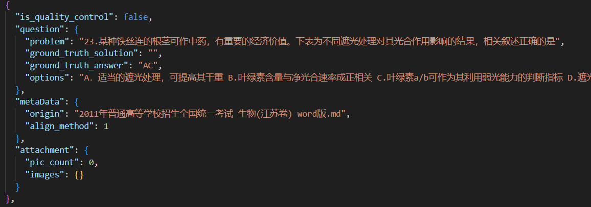
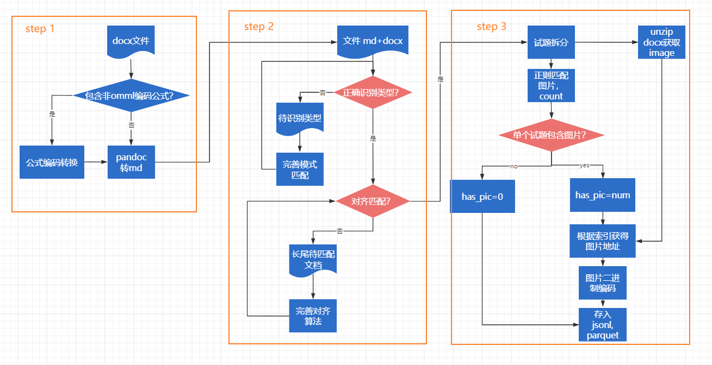
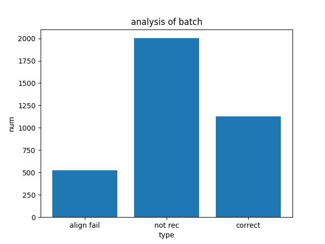

# EXAM docx to jsonl data pipeline
该工作属于开源项目MNBVC问答语料处理的一部分，旨在创造一个用来自动拆分试题类docx文档为jsonl格式的数据处理管线。

special features：
- 支持equation editor 3.0公式编码转换。将word文档里ee (equation editor 3.0)编码的公式转换为pandoc支持的微软omml（Office Math Markup Language ）编码
- 支持拆分带图片的试卷。图片将以二进制编码的格式跟随试题。
- 支持使用GPT来拆分试题，端到端生成json格式数据



数据项|解释
-|-
is_quality_control|是否经过质量核查（默认为false）
question/problem|问题题干
question/gt_solution|GT问题解析
question/gt_answer|GT问题答案
question/options|选择题选项
origin|原始文件名
align_method|0：通过rule拆分；1：通过GPT拆分；2：GPT拆分未完成（需调整max_token）
pic_count|该题目内包含图片数量
image|字典，包含图片的base64编码


# 处理流程


1.使用pandoc将docx文档转换为md格式。

2.通过对试卷文本进行模式匹配以及对齐匹配，筛选出适配的文档，非适配文档分类归纳。

3.试题拆分为json格式，图片存为二进制，跟随试题。

# 代码使用
### 0.环境安装
   
    pip install psutil pywinauto tqdm pywin32 base64 zipfile re shutil


### 1.docx2json 全流程使用
#### 1.1 安装宏
打开word添加VAB宏，注意宏的位置为**所有文档**
```vba
Sub SelectEntireDocument()
    Selection.WholeStory
End Sub
```
#### 1.2 下载pandoc
https://pandoc.org/installing.html

记住安装位置
#### 1.3 调用命令行
```bash
run.sh <input_dir> <output_dir> <pandoc_dir> \
 <align_not_dir> <align_fail_dir> <output_json_file> <--handle_pic>
```
- 参数 <input_dir> 为待处理docx文档绝对路径
- 参数 <output_dir> 为输出md文档的绝对路径
- 参数 <pandoc_dir> 为pandoc.exe所在的绝对路径
- 参数 <align_not_dir> 为试题对齐中，无法匹配模板文档归纳的绝对路径
- 参数 <align_fail_dir> 为试题对齐中，对齐失败文档归纳的绝对路径
- 参数 <output_json_file> 为保存最终json文件的路径，注意是一个文件 e.g. .\test.json
- <--handle_pic> 是否处理带图片的题目，有这个指示则处理，没有则跳过，仅处理纯文本题目

建议按照如下的文件结构存储您的数据：
```
|-- input
|-- output
|-- json
|   |--test.jsonl
|-- rule_align_fail_files
|-- rule_not_rec_files
```


### 2.md2json 仅使用解析器
```bash
python extract_and_align_exam.py <input_dir> <output_json_file>
 <align_not_dir> <align_fail_dir> 
```
- 参数 <input_dir> 为待处理docx与md文档绝对路径，docx与md需放在同一地址下
- 参数 <output_json_file> 为保存最终json文件的路径，注意是一个文件 e.g. .\test.json
- 参数 <align_not_dir> 为试题对齐中，无法匹配模板文档归纳的绝对路径
- 参数 <align_fail_dir> 为试题对齐中，对齐失败文档归纳的绝对路径


跑完全部的数据后，会自动弹出分类统计表格，显示这一批次的数据中，成功，对齐失败，模式不匹配的文档数量直方图。



### 3.使用GPT对处理失败的试卷再次处理
```bash
python GPT_align_exam.py <output_dir> <output_json_file>
 <align_not_dir> <align_fail_dir> <gpt_api_key>
```

- 参数 <output_dir> 为gpt对齐成功后，原始文件保存的地址
- 参数 <gpt_api_key> 暂定为moonshot api，若使用其他家的api请自行修改GPTAlignment/GPTAlignment.py中的代码

说明：
- 该命令主要是对已有解析器无法对齐的试卷，即被分配到not rec 和align fail的试卷，再次进行对齐。
- 目前测试中moonshot 在中文试卷处理任务里面，窗口足够，为128k，指令跟随能力最强。因此本项目暂只支持moonshot api接入。


# 解析器介绍

### standard exam parser
面向类高考试卷的解析器，此类试卷特征为：前半部分为题目，后半部分为答案解析，题目与答案中间有分割关键词 e.g. 参考答案，答案解析等。
通过对试卷进行题目与答案的分割，再到每一个子块分割序号，最后对齐。

### annotated exam parser
面向题目与答案在一起的试卷类型，题目1，答案1，题目2，答案2·····。
