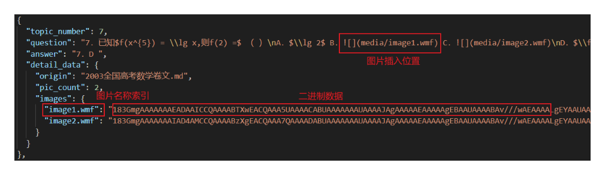
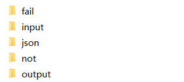

# EXAM docx to jsonl data pipeline
该工作属于开源项目MNBVC问答语料处理的一部分，旨在创造一个用来自动拆分试题类docx文档为jsonl格式的数据处理管线。

special features：
- 支持equation editor 3.0公式编码转换。将word文档里ee (equation editor 3.0)编码的公式转换为pandoc支持的微软omml（Office Math Markup Language ）编码
- 支持拆分带图片的试卷。图片将以二进制编码的格式跟随试题。



# 处理流程


1.使用pandoc将docx文档转换为md格式。

2.通过对试卷文本进行模式匹配以及对齐匹配，筛选出适配的文档，非适配文档分类归纳。

3.试题拆分为json格式，图片存为二进制，跟随试题。

# 代码使用
0.环境安装
   
    pip install psutil pywinauto tqdm pywin32 base64 zipfile re shutil


1.调用命令行
```bash
run.sh <input_dir> <output_dir> <pandoc_dir> \
 <align_not_dir> <align_fail_dir> <output_json_file>
```
- 参数 <input_dir> 为待处理docx文档绝对路径
- 参数 <output_dir> 为输出md文档的绝对路径
- 参数 <pandoc_dir> 为pandoc.exe所在的绝对路径
- 参数 <align_not_dir> 为试题对齐中，无法匹配模板文档归纳的绝对路径
- 参数 <align_fail_dir> 为试题对齐中，对齐失败文档归纳的绝对路径
- 参数 <output_json_file> 为保存最终json文件的路径，注意是一个文件 e.g. .\test.json

建议按照如下的文件结构存储您的数据：



2.结果分析
跑完全部的数据后，会自动弹出分类统计表格，显示这一批次的数据中，成功，对齐失败，模式不匹配的文档数量直方图。

